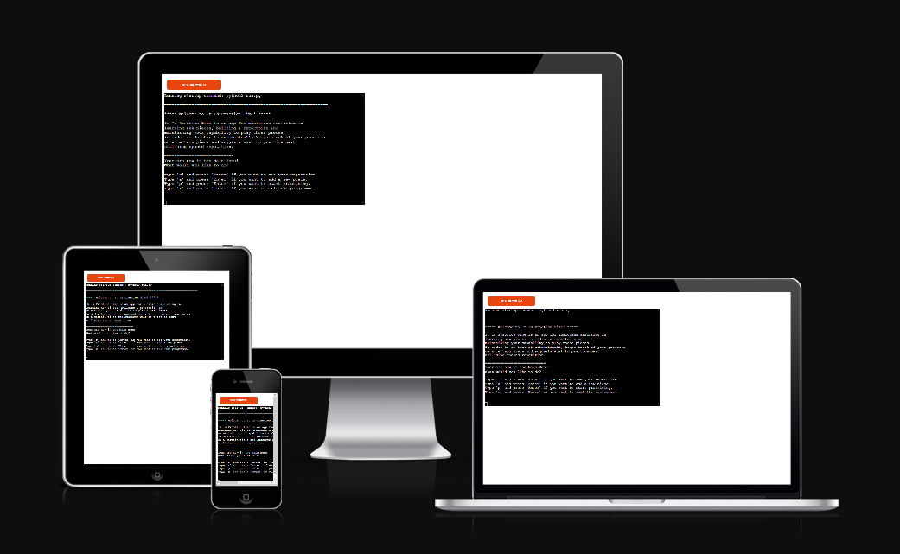
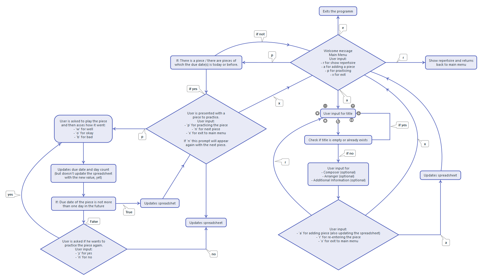
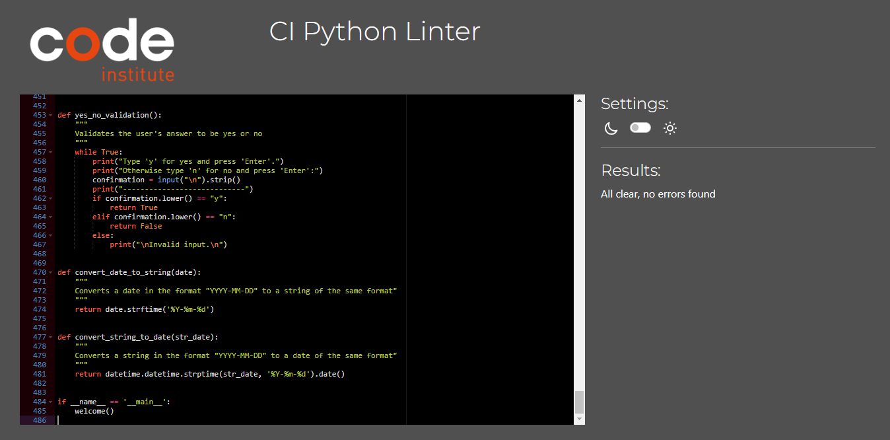
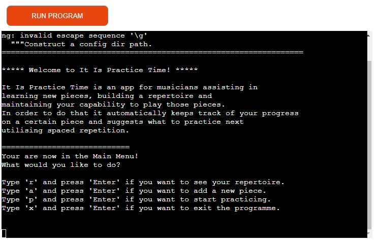
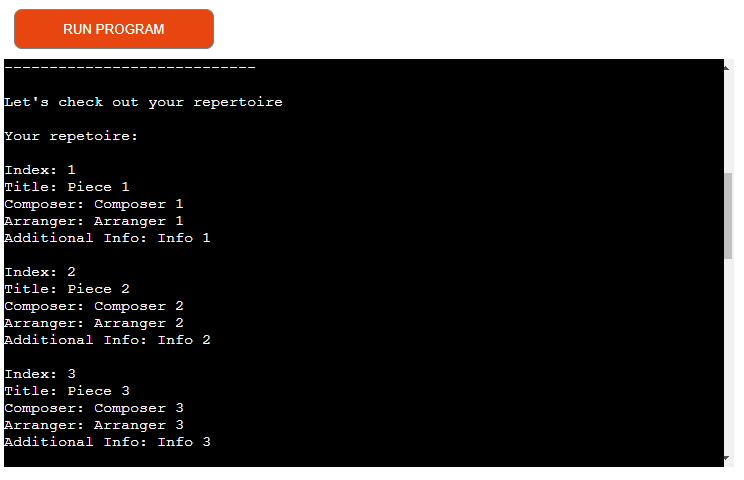
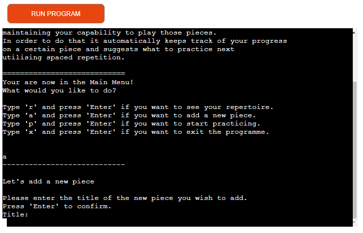
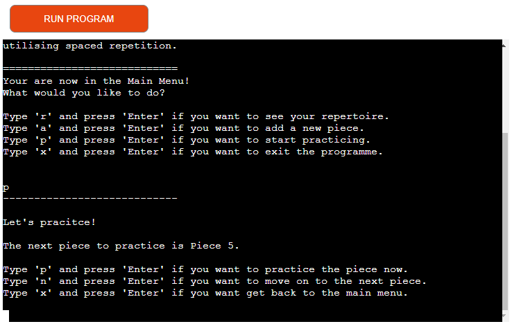
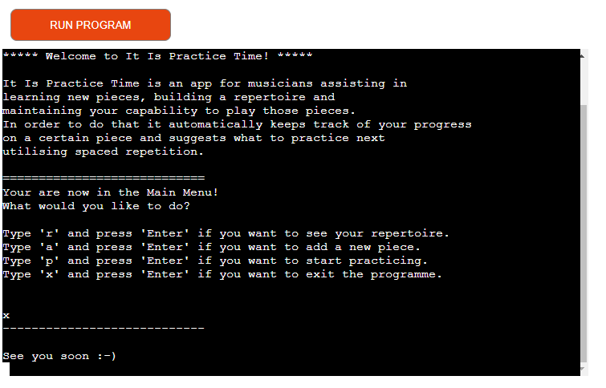

# It Is Practice Time

It Is Practice Time is a Python terminal app for musicians that utilizes spaced repetition to assist in learning new pieces as well as maintaining an already existing repertoire.

In order to achieve that the app takes care of tracking the progress on a previously added piece through user input, uses that progress to calculate the next time the piece should be practiced and thus automatically suggests what to practice in a given practice session.

Thereby it not only relieves the musician from figuring out what to practice next, which can be time consuming especially if the repertoire increases to a large number of pieces, but also from keeping track of the progress manually. Furthermore it gives her/him the peace of mind that no piece will be forgotten and it will be suggested for practice when the time comes.

All this leads to a more enjoyable practice experience since it streamlines the process by taking care of some of the "book keeping" and decision making and thus helps the musician to focus on the most important part of a practice session: to play music.

## Table of Contents

- User Stories
- Features
- Future Features
- Flow Chart
- Technology
- Testing
- Deployment
- Links
- Credits

## User Stories

- I want to see what and how many pieces are in my repertoire.

- I want to add new pieces to my repertoire.

- I want to practice my pieces without having to ponder what to play next.

- If I am done I want to exit the app.

## Features

Main Menu

- In the main menu the user can select between four options:
    - Showing the already existing repertoire
    - Adding a new piece
    - Practicing
    - Exiting the app

Repertoire

- List of the the pieces in the repertoire with the index of the piece and the information the user added. With the mouse can scroll through the repertoire.

Adding a New Piece

- The user adds the title of the piece, the composer (optional), the arranger (optional) and any additional information (optional)
- As for the title the app checks whether or not the piece already exists or if the user put no title or just spaces which are all invalid inputs. This will also be reflected to the user.

Practicing

- A piece is suggested to the user to practice. The user can then decide if she/he wants to practice that piece, move on to the next one or go back to the main menu.
- If the user has practiced a piece and assessed how it went, she/he is then asked if she/he wants to practice it again or not or, in the case that the piece's next due date is more than two days in the future, the user is suggested the next piece.
- This process continues until the new due dates of the pieces are at least two days in the future or the user decides to end the practice session by returning to the main menu.

Exiting

- Exits the app.

## Future Features

- A graphical interface to make using the app more appealing.
- The user would be able to break up pieces themselves into several parts which have there own due dates. Only after all the due parts are practiced enough so that they are not due anymore the due date of the piece itself gets updated. If the user skips a part that would be due the due date of the piece would not be updated but for the current practice session she/he would still move on to the next piece.
- Adding tracking at which tempo the user is able to play a certain piece or part of it measured in beats per minute. Before updating the due date the tempo would be updated until the user is at a previously defined tempo goal. In contrast to updating the due date here negative values are also possible since if a piece/part doesn't work the user should first practice it slower.
- Removing piece from the list that the user no longer wants to practice at all.
- Editing pieces after they have been added.

## Flow Chart

## Technology

- Codeanywhere was used to write and edit the code.
- GitHub was used to store the code.
- Google sheets was used to create the spreadsheet. (Here is the link to the spreadsheet with some test pieces: https://docs.google.com/spreadsheets/d/1ewUcy7MnR0jFcMQZrFwKQAzN-sXDypiLj5r_iFbshtY/edit?usp=sharing)
- Heroku was used to deploy the code in Code Institute's mock terminal.

## Testing

### Code Validation

- The PEP8 Python Validator was used to check the code. No error were found.

### User Stories

- I want to see what and how many pieces are in my repertoire.
    - In the main menu I simply have to type 'r' and press 'Enter' and I am able to scroll my repertoire.

- I want to add new pieces to my repertoire.
    - In the main menu I simply have to type 'a' and press 'Enter' upon which I will be asked to enter all the details of piece.

- I want to practice my pieces without having to ponder what to play next.
    - In the main menu I simply have to type 'p' and press 'Enter'. A piece is suggested to me and I can start practicing or move on to the next piece.

- If I am done I want to exit the app.
    - In the main menu I simply have to type 'x' and press 'Enter' to exit the app.

### Sample images for Situations (see also table below)

- Main Menu

- Repertoire (scrolled up to the beginning)

- Adding a New Piece - User is prompted to enter and confirm a title

- Practicing - User is suggested the next piece to practice

- Exiting (after typeing 'x' and pressing 'Enter')

### Manual Testing

| Situation             | User Action | Outcome | Test Result |
| :------------------ | :---------: | :------ | :---------: |
| Main menu | 'r' + confirmation with 'Enter' | Repertoire is displayed and the user is redirected to the main menu | passed |
| Main menu | 'a' + confirmation with 'Enter' | User is prompted to enter and confirm a title | passed |
| User is prompted to enter and confirm a title | [already existing title] + confirmation with 'Enter' | User is informed that the title already exists, that a new name is required and prompted to enter and confirm a title again | passed |
| User is prompted to enter and confirm a title | [just one or multiple spaces] + confirmation with 'Enter' | User is informed that the title can not be empty and prompted to enter and confirm a title again | passed |
| User is prompted to enter and confirm a title | [title] + confirmation with 'Enter' | User is prompted to enter and confirm a composer | passed |
| User is prompted to enter and confirm a composer | [composer (optional)] + confirmation with 'Enter' | User is prompted to enter and confirm an arranger | passed |
| User is prompted to enter and confirm an arranger | [arranger (optional)] + confirmation with 'Enter' | User is prompted to enter and confirm additional information | passed |
| User is prompted to enter and confirm additional information | [additional information (optional)] + confirmation with 'Enter' | User is prompted to check if the given data is correct | passed |
| User is prompted to check if the given data is correct | 'a' + confirmation with 'Enter' | User is informed that the new piece has been added and is redirected to the main menu. Also the spreadsheet is updated (with cells left blank if no input was given) | passed |
| User is prompted to check if the given data is correct | 'r' + confirmation with 'Enter' | User is prompted to enter and confirm a title | passed |
| User is prompted to check if the given data is correct | 'x' + confirmation with 'Enter' | User is redirected to the main menu | passed |
| Main menu | 'p' + confirmation with 'Enter' | User is suggested the next piece to practice | passed |
| User is suggested the next piece to practice | 'p' + confirmation with 'Enter' | User is asked to practice and to assess it | passed |
| User is suggested the next piece to practice | 'n' + confirmation with 'Enter' | User is suggested the next piece to practice | passed |
| User is suggested the next piece to practice | 'x' + confirmation with 'Enter' | User is redirected to main menu | passed |
| User is asked to practice and to assess it | 'w' + confirmation with 'Enter' | (If the new due date is tomorrow) User is informed that the due date was updated, that the next due date for the piece is tomorrow and asked if she/he wants to practice it anyway | passed |
| User is asked to practice and to assess it | 'w' + confirmation with 'Enter' | (If the new due date is after tomorrow and if there are more pieces to be practiced) User is informed that the due date was updated, that the piece won't be due for another two days and suggested the next piece to practice. Also the spreadsheet is updated | passed |
| User is asked to practice and to assess it | 'w' + confirmation with 'Enter' | (If the new due date is after tomorrow and if there are no more pieces to be practiced) User is informed that the due date was updated, that she/he got through all the material and is redirected to the main menu. Also the spreadsheet is updated | passed |
| User is asked to practice and to assess it | 'o' + confirmation with 'Enter' | (if the new due date is today or before) User is informed that the due date was updated and asked if she/he wants to practice the piece again | passed |
| User is asked to practice and to assess it | 'o' + confirmation with 'Enter' | (if the new due date is tomorrow) User is informed that the due date was updated, that the next due date for the piece is tomorrow and asked if she/he wants to practice it anyway | passed |
| User is asked to practice and to assess it | 'o' + confirmation with 'Enter' | (If the new due date is after tomorrow and if there are more pieces to be practiced) User is informed that the due date was updated, that the piece won't be due for another two days and suggested the next piece to practice. Also the spreadsheet is updated | passed |
| User is asked to practice and to assess it | 'o' + confirmation with 'Enter' | (If the new due date is after tomorrow and if there are no more pieces to be practiced) User is informed that the due date was updated, that she/he got through all the material and is redirected to the main menu. Also the spreadsheet is updated | passed |
| User is asked to practice and to assess it | 'b' + confirmation with 'Enter' | (if the new due date is today or before) User is informed that the due date was updated and asked if she/he wants to practice the piece again | passed |
| User is asked to practice and to assess it | 'b' + confirmation with 'Enter' | (if the new due date is tomorrow) User is informed that the due date was updated, that the next due date for the piece is tomorrow and asked if she/he wants to practice it anyway | passed |
| User is asked to practice and to assess it | 'b' + confirmation with 'Enter' | (If the new due date is after tomorrow and if there are more pieces to be practiced) User is informed that the due date was updated, that the piece won't be due for another two days and suggested the next piece to practice. Also the spreadsheet is updated | passed |
| User is asked to practice and to assess it | 'b' + confirmation with 'Enter' | (If the new due date is after tomorrow and if there are no more pieces to be practiced) User is informed that the due date was updated, that she/he got through all the material and is redirected to the main menu. Also the spreadsheet is updated | passed |
| User is informed that the due date was updated and asked if she/he wants to practice the piece again | 'y' + confirmation with 'Enter' | User is asked to practice and to assess it | passed |
| User is informed that the due date was updated and asked if she/he wants to practice the piece again | 'n' + confirmation with 'Enter' | (If there are more pieces to be practiced) User is informed that the due date was updated and suggested the next piece to practice. Also the spreadsheet is updated | passed |
| User is informed that the due date was updated and asked if she/he wants to practice the piece again | 'n' + confirmation with 'Enter' | (If there are no more pieces to be practiced) User is informed that the due date was updated, that she/he got through all the material and is redirected to the main menu. Also the spreadsheet is updated | passed |
| User is informed that the due date was updated, that the next due date for the piece is tomorrow and asked if she/he wants to practice it anyway | 'y' + confirmation with 'Enter' | User is asked to practice and to assess it | passed |
| User is informed that the due date was updated, that the next due date for the piece is tomorrow and asked if she/he wants to practice it anyway | 'n' + confirmation with 'Enter' | (If there are more pieces to be practiced) User is informed that the due date was updated and suggested the next piece to practice. Also the spreadsheet is updated | passed |
| User is informed that the due date was updated, that the next due date for the piece is tomorrow and asked if she/he wants to practice it anyway | 'n' + confirmation with 'Enter' | (If there are no more pieces to be practiced) User is informed that the due date was updated, that she/he got through all the material and is redirected to the main menu. Also the spreadsheet is updated | passed |
| Main menu | 'x' + confirmation with 'Enter' | Exits app or (in the mock terminal) doesn't return to the main menu | passed |
| [Any] | '[any other input than the ones to be choosen from]' + confirmation with 'Enter' | The User will be notified that it was an invalid input and the same prompt/question appears again | passed |

### Bugs

#### Solved Bugs
- I could not figure out how to sort a list of list by an item in the sublists other than the first one.
    - After many trys and a lot of research for solutions I eventually found the expression 'key = lambda' which worked.

- When adjusting the code to pass the PEP8 Python Validator the value for the new_due_date variable in the update_due_date_and_count() function I was unable to split the expression (an addition) over two lines with using a backshlash.
    - I solved this by utilising an extra variable with a short name, assigning it the value of one of the terms and then using that variable in the addition.

- To pass the PEP8 Python Validator I had to shorten some of the print statement or stretch them over several lines. I thought that since the statement is between brackets I could split the state into another. However, that didn't work: It was still displayed in one line with the now added space from the identation of the second line.
    - I solved this by putting quotation marks at the end of the first and the beginning of the second line and also adding a \n at the end of the first line thus effectively splitting the statement into to several statements. I also could have simply printed a new statement but since it was one sentence I wanted to keep it in one statement.

#### Unsolved Bugs
- Currently there are no know unsolved bugs.

## Deployment

### Deployment using GitHub, Google Sheets and Gitpod
- Create GitHub account. (If this is already done you can skip this step.)
- Create Google account. (If this is already done you can skip this step.)
- Create Gitpod account. (If this is already done you can skip this step.)
- Add Gitpod extension to your Browser. (Google Chrome is recommended.)
- Log into GitHub account.
- Fork or clone this repository.
- Log into Google account.
- Rename the first worksheet to 'Index' (without the quotation marks). Pay attention that it is spelled correctly!
- In the **first row** add the following (without the quotation marks and pay attention that it is spelled correctly! Otherwise the app won't work correctly):
    - Column A: 'Index numnber'
    - Column B: 'Title'
    - Column C: 'Composer'
    - Column D: 'Arranger'
    - Column E: 'Additional Information'
    - Column F: 'Timestamp'
    - Column G: 'Count'
- Go to https://console.cloud.google.com/welcome/new?pli=1
- Make sure you are logged in with a personal account.
- Click on 'Select a project'.
- Click on 'New Project'.
- Give the project a name.
- Click on 'Create'.
- Click on 'Select a project' again and select the project.
- Open the side menu by clicking on the burger icon on left upper side.
- Click on 'APIs and services' and then select 'Library'.
- In the searchbar search for 'google drive'.
- Click on the Google Drive API that appears in the search results (probably the first result).
- On the next page click on 'Enable'.
- On the next page Click on 'Create Credentials' on the right side.
- In the dropdown menu under 'Which API are you using?' select 'Google Drive API'.
- Under 'What data will you be accessing?' select 'Application Data'.
- Under 'Are you planning to use this API with Compute Engine, Kubernetes Engine, App Engine, or Cloud Functions?' select 'No, I'm not using them'
- Click on 'Next'.
- Enter a service account name in the designated input field.
- Click on 'Create'.
- In the 'Role'-dropdown menu choose 'Basic' and then 'Editor'.
- Click on 'Continue'.
- The next options can be left blank. Click on 'Done'.
- On the next page scroll to 'Service Account' and click on the one that you just created.
- Click on the 'Keys'-tab.
- Click on the 'Add Key'-dropdown menu and select 'Create New Key'
- Select 'JSON' and click on 'Create'. The json file with your API credentials will be downloaded into the designated folder on your computer (usually the 'Downloads'-folder).
- Go back to the library again (see above) and search for 'googe sheets'.
- Click on the Google Sheets API.
- Click on 'Enable'.
- Go to the cloned or forked version of this repository in your own GitHub account and open it with your Gitpod.
- Drag and drop the JSON file from the folder on your machine to your Gitpod workspace.
- Rename it to creds.json.
- Open the .gitignore file.
- Add 'creds.json' (without quotation marks) to the list.
- Open the creds.json file.
- Under 'client_email' you find an email address. Copy it without the quotation marks.
- Go back to your Google spreadsheet and click on 'Share' near the top right corner.
- Paste in the email address.
- Select 'Editor' if that is not already done.
- Untick notify people.
- Click on 'Share'.
- Open the terminal in Gitpod.
- Type 'python3 run.py' (no quotation marks) and press 'Enter'

### Deployment using GitHub, Google Sheets and Gitpod and Heroku
- Make sure you completed all the steps from the 'Deployment using GitHub, Google Sheets and Gitpod'-section above.
- Create Heroku account. (If this is already done you can skip this step.)
- Log into Heroku account.
- Click on 'Create new app' on the dashboard. Alternatively click on the 'New'-button in the upper right corner of the dashboard and select 'Create new app' from the dropdown menu.
- Give your app a valid name in the designated input field.
- Select your region.
- Click on 'Create app'.
- On the next screen select the 'Settings'-tab.
- Scroll down and click on the 'Reveal Config Vars'-button.
- Enter 'CREDS' into the 'Key'-field.
- For the 'Value'-field go back to Gitpod and open the creds.json file.
- Copy the whole content of the file.
- Go back to Heroku and paste it into the 'Value'-field.
- In the next 'Key'-field type 'PORT' (all uppercase, no quotation marks).
- In the 'Value'-field type '8000' (no quotation marks).
- Scroll down and click on 'Add buildpacks'.
- Click on 'Python'.
- Click on 'Save changes'.
- Click on 'Add buildpacks' again.
- Click on 'nodejs'.
- Click on 'Save changes'.
- Make sure the buildpacks appear in that order ('Python' on top, 'nodejs' underneath). If not, click and drag them in that order.
- Scroll up and click on the 'Deploy'-tab.
- For 'Deployment method' choose 'GitHub'.
- Click on 'Connect to GitHub'.
- Search for the repository name (don't forget to click on 'Search').
- Click on 'Connect' next to the correct repository.
- Scroll down and click on 'Deploy Branch'.
- Wait until the app is built.
- Finally, click on 'View'.

## Links

- Here is the link to the spreadsheet with some test pieces: https://docs.google.com/spreadsheets/d/1ewUcy7MnR0jFcMQZrFwKQAzN-sXDypiLj5r_iFbshtY/edit?usp=sharing

## Credits

- To connect API with Python part of the code from Code Institute's 'Love Sandwiches Walkthrough Project > Getting Set Up > Connecting to our API with Python' fourth video (1:32 to 4:28) was copied and pasted in.
- Code Institute's mock terminal was used to deploy the app.
- My mentor Rohit Sharma from Code Institute suggested to use the if __name__ == '__main__': expression to start the app which I did.

